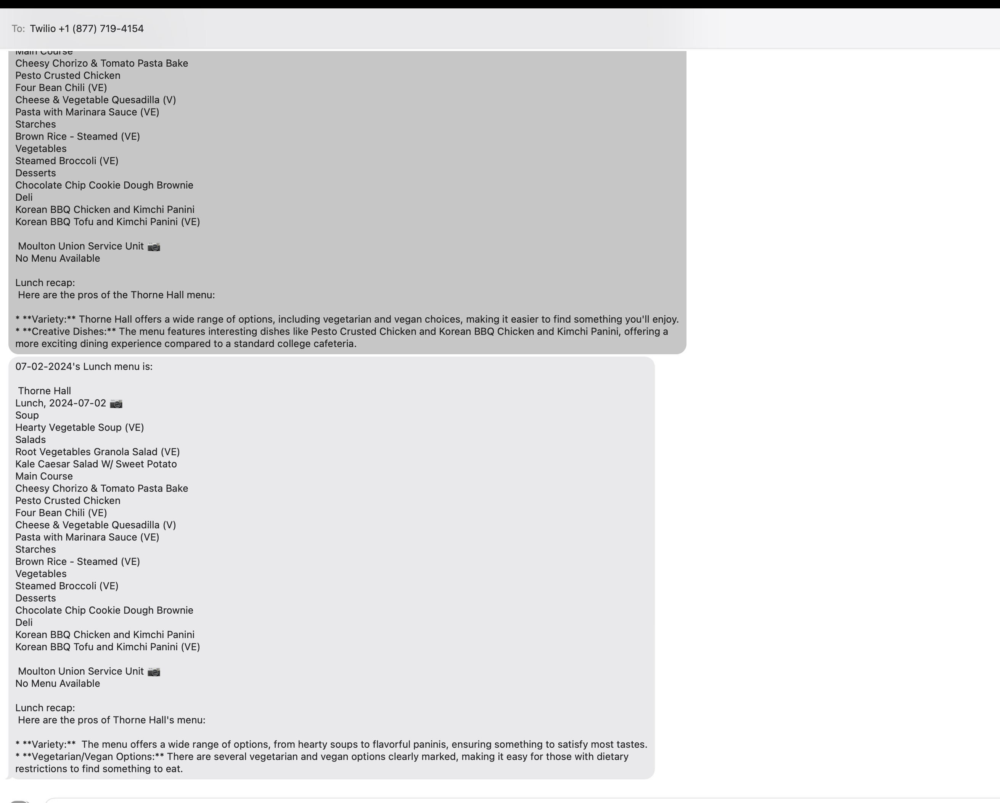

# MealMessenger

MealMessenger is a service that sends daily dining hall menus via SMS using Selenium for web scraping, Google Gemini for AI-generated summaries, and the Twilio API for messaging. This project automates the process of keeping Bowdoin students informed about their dining options without requiring manual lookup.

## Features

- **Automated Web Scraping:** Uses Selenium to scrape daily menus from dining hall websites.
- **AI Summaries:** Integrates with Google Gemini to provide concise and relevant summaries of the menu items.
- **SMS Notifications:** Sends menu and summaries via SMS using the Twilio API.

## Tech Stack

- **Selenium:** For automated web scraping of dining hall menus.
- **Google Gemini:** For generating AI summaries of menu items.
- **Twilio API:** For sending SMS notifications to users.
- **Python:** The main programming language used for development.

## License

This project is licensed under the MIT License - see the [LICENSE](LICENSE) file for details.

## Contact

For any questions or suggestions, please reach out to [mingikang31@gmail.com](mailto:mingikang31@gmail.com).
